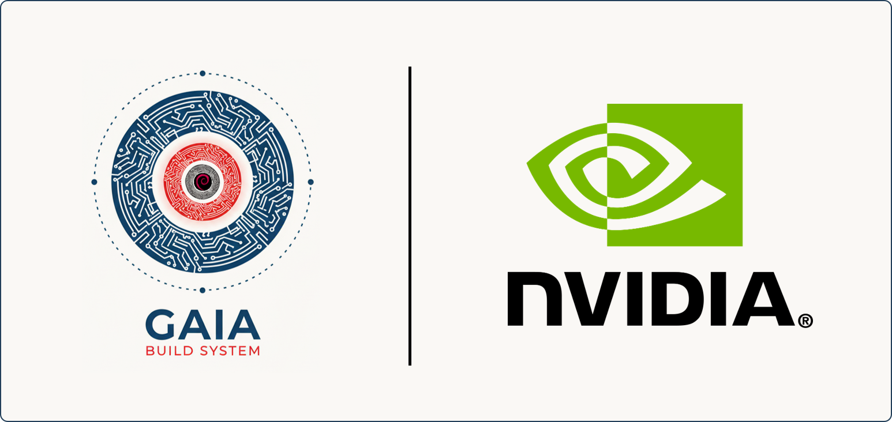

# Cookbook for NVIDIA Tegra Machines

<p align="center">
    
</p>

This cookbook provides a collection of recipes to help you get started with DeimOS for NVIDIA Tegra based boards.

## Supported Boards -> Machines

| Board                      | Gaia Machine Name   |
|----------------------------|---------------------|
| Jetson Orin Nano              | orin                |

## Prerequisites

- [Gaia project Gaia Core](https://github.com/gaiaBuildSystem/gaia);

## Build an Image

```bash
./gaia/bitcook --buildPath /home/user/workdir --distro ./cookbook-tegra/distro-ref-jetson-orin.json --noCache
```

This will build DeimOS for Jetson Orin.
